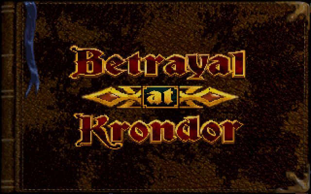
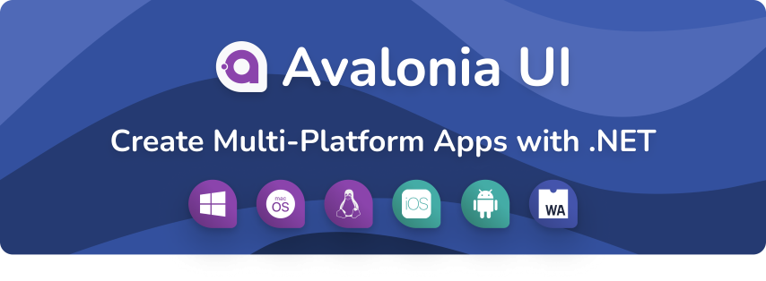

# Spice86 - A PC emulator for real mode reverse engineering


[](https://github.com/OpenRakis/Spice86/actions/workflows/prerelease.yml)
[](https://www.nuget.org/packages/Spice86)

[](https://www.nuget.org/packages/Spice86)

Spice86 is a tool to execute, reverse engineer and rewrite real mode DOS programs for which source code is not available.

Releases are available [on Nuget](https://www.nuget.org/packages/Spice86/).

Pre-releases are also available [on the Release page](https://github.com/OpenRakis/Spice86/releases/tag/latest)

NOTE: This is a port, and a continuation from the [original Java Spice86](https://github.com/kevinferrare/spice86).

It requires [.NET 8](https://dotnet.microsoft.com/en-us/download/dotnet/8.0) and runs on Windows, macOS, and Linux.

## Approach
Rewriting a program from only the binary is a hard task.

Spice86 is a tool that helps you do so with a methodic divide and conquer approach.

General process:
- You start by emulating the program in the Spice86 emulator.
- At the end of each run, the emulator dumps some runtime data (memory dump and execution flow)
- You load those data into [ghidra](https://github.com/NationalSecurityAgency/ghidra) via the [spice86-ghidra-plugin](https://github.com/OpenRakis/spice86-ghidra-plugin)
- The plugin converts the assembly instructions in the memory dump to C# that can be loaded into spice86 and used either partially or completely instead of the assembly code.
- This allows you to gradually reimplement the assembly code with your C# methods
- This is helpful because:
  - Small sequences of assembly can be statically analyzed and are generally easy to translate to a higher level language.
  - You work all the time with a fully working version of the program so it is relatively easy to catch mistakes early.
  - Rewriting code function by function allows you to discover the intent of the author.

## Running your exe

| Command | Description |
|---------|-------------|
| `Spice86 -e file.exe` | Run the specified executable |
| `Spice86 -e file.com` | Run a COM file |
| `Spice86 -e file.bin` | Run a BIOS file |

## Dumping data

| Setting | Description |
|---------|-------------|
| Environment Variable | `SPICE86_DUMPS_FOLDER` - Set this to control where data is dumped |
| Command Line | Use `--RecordedDataDirectory` to specify the dump location |
| Default Location | Current directory if neither of the above is specified |

The emulator dumps the following files:
- **spice86dumpMemoryDump.bin**: Snapshot of the real mode address space
- **spice86dumpExecutionFlow.json**: Contains function addresses, labels, and executed instructions

When there is already data in the specified location, the emulator will load it first and complement it.

## Command line options

```
  --Debug                            (Default: false) Starts the program paused and pauses once again when stopping.
  --Cycles                           (Default: null) Target CPU cycles per ms, for the rare speed sensitive game. Unused by default. Overrides Instructions per second option below if used.
  --Xms                              (Default: true) Enables 15 MB of XMS memory.
  --Ems                              (Default: true) Enables EMS memory. EMS adds 8 MB of memory accessible to DOS programs through the EMM Page Frame.
  --A20Gate                          (Default: false) Disables the 20th address line to support programs relying on the rollover of memory addresses above the HMA (slightly above 1 MB).
  -m, --Mt32RomsPath                 Zip file or directory containing the MT-32 ROM files
  -c, --CDrive                       Path to C drive, default is exe parent
  -r, --RecordedDataDirectory        Directory to dump data to when not specified otherwise. Working directory if blank
  -e, --Exe                          Required. Path to executable
  -a, --ExeArgs                      List of parameters to give to the emulated program
  -x, --ExpectedChecksum             Hexadecimal string representing the expected SHA256 checksum of the emulated program
  -f, --FailOnUnhandledPort          (Default: false) If true, will fail when encountering an unhandled IO port. Useful to check for unimplemented hardware. false by default.
  -g, --GdbPort                      GDB port. If 0, GDB server will be disabled. Default is 10000.
  -o, --OverrideSupplierClassName    Name of a class that will generate the initial function information. See documentation for more information.
  -p, --ProgramEntryPointSegment     (Default: 4096) Segment where to load the program. DOS PSP and MCB will be created before it.
  -u, --UseCodeOverride              (Default: true) <true or false> if false it will use the names provided by overrideSupplierClassName but not the code
  -i, --InstructionsPerSecond        <number of instructions that have to be executed by the emulator to consider a second passed> if blank will use time based timer.
  -t, --TimeMultiplier               (Default: 1) <time multiplier> if >1 will go faster, if <1 will go slower.
  -d, --DumpDataOnExit               (Default: true) When true, records data at runtime and dumps them at exit time
  -h, --HeadlessMode [Mode]          (Default: false) Headless mode. The mode 'Minimal' does not use any UI components, 'Avalonia' uses the full UI and consumes a bit more memory.
  -l, --VerboseLogs                  (Default: false) Enable verbose level logs
  -w, --WarningLogs                  (Default: false) Enable warning level logs
  -s, --SilencedLogs                 (Default: false) Disable all logs
  -i, --InitializeDOS                (Default: true) Install DOS interrupt vectors or not.
  --StructureFile                    Path to a C header file that describes the structures in the application. Works best with exports from IDA or Ghidra
  --help                             Display this help screen.
  --version                          Display version information.
```

## Dynamic analysis
Spice86 speaks the [GDB](https://www.gnu.org/software/gdb/) remote protocol:
- it supports most of the commands you need to debug.
- it also provides custom GDB commands to do dynamic analysis.

### Connecting to GDB
The GDB server is always started along with the program to execute unless option is set to 0.
Default port is 10000.

If you want to pause before starting execution to setup breakpoints and so on, use the --Debug option.

Here is how to connect from GDB command line client and how to set the architecture:
```
(gdb) target remote localhost:10000
(gdb) set architecture i8086
```

### Vanilla GDB
You can add breakpoints, step, view memory and so on.

Example with a breakpoint on VGA VRAM writes:
```
(gdb) watch *0xA0000
```

Viewing assembly:
```
(gdb) layout asm
```

Removing a breakpoint:
```
(gdb) remove 1
```

Searching for a sequence of bytes in memory (start address 0, length F0000, ascii bytes of 'Spice86' string):
```
(gdb) find /b 0x0, 0xF0000, 0x53, 0x70, 0x69, 0x63, 0x65, 0x38, 0x36
```

GDB does not support x86 real mode segmented addressing, so pointers need to refer to the actual physical address in memory. VRAM at address A000:0000 would be 0xA0000 in GDB.

Similarly, The $pc variable in GDB will be exposed by Spice86 as the physical address pointed by CS:IP.

### Custom GDB commands (where the magic happens)
The list of custom commands can be displayed like this:
```
(gdb) monitor help
```

#### Dump information about current run
```
(gdb) monitor dumpall
```
Dumps everything described below in one shot. Files are created in the dump folder as explained [here](https://github.com/OpenRakis/Spice86#dumping-data)
Several files are produced:
 - spice86dumpMemoryDump.bin: Snapshot of the real mode address space. Contains the instructions that are actually loaded and executed. They may differ from the exe you are running because DOS programs can rewrite some of their instructions / load additional modules in memory.
 - spice86dumpExecutionFlow.json: Contains information used by the [spice86-ghidra-plugin](https://github.com/OpenRakis/spice86-ghidra-plugin) to make sense of the memory dump, like addresses of the functions, the labels, the instructions that have been executed ...

#### Special breakpoints
Break after x emulated CPU Cycles:
```
(gdb) monitor breakCycles 1000
```

Break at the end of the emulated program:
```
(gdb) monitor breakStop
```

## Seer
For a pleasing and productive experience with GDB, the
[seerGDB](https://github.com/epasveer/seer) client is highly recommended.

At best, use the configuration file `spice86.seer` provided in the `doc` directory ([here](doc/spice86.seer)): run Seer with `seergdb --project spice86.seer`.

If you use a different port for gdb, adjust `spice86.seer` correspondingly.

Also, while in Seer, set Settings/Configuration/Assembly/Disassembly Mode to
“Length”, otherwise the Assembly View won't work.

## Emulator features

| Component | Support Level |
|-----------|--------------|
| **CPU** | 8086/8088 fully implemented and tested |
|  | 80186 (BOUND instruction missing) |
|  | 80286 (protected mode not implemented) |
|  | 80386 (partial support, protected mode not implemented) |
|  | Only 16-bit instructions fully supported |
|  | Most 32-bit instructions implemented but not fully tested |
|  | No FPU except detection instructions |
| **Memory** | 1MB address space with segmented addressing |
|  | A20 Gate support |
|  | EMS 3.2 implemented |
|  | XMS 4.0 is implemented |
|  | HMA is implemented |
|  | No paging support |
| **Graphics** | Text modes, VGA, EGA, and CGA implemented |
|  | EGA and CGA modes are best effort (you may find bugs) |
|  | No VESA support |
| **DOS** | Partial int 21h implementation (DOS 5.0) |
| **Input** | Keyboard and mouse supported |
|  | No joystick support |
| **CD-ROM** | No MSCDEX support |
| **Floppy** | No Floppy Disk support |

## Sound support

| Sound Type | Support Level | Notes |
|------------|---------------|-------|
| PC Speaker | ✅ Full | Implemented |
| Adlib/SB OPL | ✅ Full | FM synthesis supported |
| SoundBlaster PCM | ✅ Full | Digital audio supported |
| SoundBlaster Mixer | ⚠️ Partial | Some registers are unimplemented |
| MT-32 | ⚠️ Partial | Not available on macOS |
| Gravis Ultrasound | ❌ None | Not implemented yet | 
| General MIDI | ✅ Full | Supported |

On Unix-like systems, libportaudio must be installed for sound to work.

## Misc

| Feature | Details |
|---------|---------|
| **C Drive** | Configurable with `--CDrive`, defaults to current folder |
| **Program Arguments** | Pass up to 127 chars with `--ExeArgs` |
| **Time Handling** | Real elapsed time (adjustable with `--TimeMultiplier`) or instruction-based timing with `--InstructionsPerSecond` |
| **Screen Refresh** | 30 FPS and on VGA retrace wait detection |
| **Structure Viewer** | Requires C header file (`--StructureFile`) to display memory structures |

## Reverse engineering process
Concrete example with Cryo Dune [here](https://github.com/OpenRakis/Cryogenic).

First run your program and make sure everything works fine in Spice86. If you encounter issues it could be due to unimplemented hardware / DOS / BIOS features.

When Spice86 exits, it should dump data in current folder or in folder specified by env variable 

Open the data in [ghidra](https://github.com/NationalSecurityAgency/ghidra) with the [spice86-ghidra-plugin](https://github.com/OpenRakis/spice86-ghidra-plugin) and generate code. You can import the generated files in a template project you generate via the [spice86-dotnet-templates](https://github.com/OpenRakis/spice86-dotnet-templates):
```
dotnet new spice86.project
```

## Overriding emulated code with C# code

You can provide your own C# code to override the program original assembly code.

### Defining overrides
Spice86 can take in input an instance of Spice86.Core.Emulator.Function.IOverrideSupplier that builds a mapping between the memory address of functions and their C# overrides.

For a complete example you can check the source code of [Cryogenic](https://github.com/OpenRakis/Cryogenic).

Here is a simple example of how it would look like:
```csharp
namespace My.Program;

// This class is responsible for providing the overrides to spice86.
// There is only one per program you reimplement.
public class MyProgramOverrideSupplier : IOverrideSupplier {
  public IDictionary<SegmentedAddress, FunctionInformation> GenerateFunctionInformations(int programStartSegment,
                                                                                 Machine machine) {
    Dictionary<SegmentedAddress, FunctionInformation> res = new();
    // In more complex examples, overrides may call each other
    new MyOverrides(res, programStartSegment, machine);
    return res;
  }

  public override string ToString() {
    return "Overrides My program exe. class is " + GetType().FullName;
  }
}

// This class contains the actual overrides. As the project grows, you will probably need to split the reverse engineered code in several classes.
public class MyOverrides : CSharpOverrideHelper {
  private MyOverridesGlobalsOnDs globalsOnDs;

  public MyOverrides(IDictionary<SegmentedAddress, FunctionInformation> functionInformations, ushort entrySegment, Machine machine, ILoggerService loggerService, Configuration configuration) {
    // "myOverides" is a prefix that will be appended to all the function names defined in this class
    base(functionInformations, machine,  loggerService, configuration);
    globalsOnDs = new MyOverridesGlobalsOnDs(machine);
    // incUnknown47A8_0x1ED_0xA1E8_0xC0B8 will get executed instead of the assembly code when a call to 1ED:A1E8 is performed.
    // Also when dumping functions, the name myOverides.incUnknown47A8 or instead of unknown
    // Note: the segment is provided in parameter as spice86 can load executables in different places depending on the configuration
    DefineFunction(segment, 0xA1E8, "incDialogueCount47A8", IncDialogueCount47A8_0x1ED_0xA1E8_0xC0B8);
    DefineFunction(segment, 0x0100, "addOneToAX", AddOneToAX_0x1ED_0x100_0x1FD0);
  }

  public Action IncDialogueCount47A8_0x1ED_0xA1E8_0xC0B8() {
    // Accessing the memory via accessors
    globalsOnDs.SetDialogueCount47A8(globalsOnDs.GetDialogueCount47A8() + 1);
    // Depends on the actual return instruction performed by the function, needed to be called from the emulated code as
    // some programs like to mess with the stack ...
    return NearRet();
  }

  private Action AddOneToAX_0x1ED_0x100_0x1FD0() {
    // Assembly for this would be
    // INC AX
    // RETF
    // Note that you can access the whole emulator to change the state in the overrides.
    state.AX++;
    return NearRet();
  }
}

// Memory accesses can be encapsulated into classes like this to give names to addresses and make the code shorter.
public class GlobalsOnDs : MemoryBasedDataStructureWithDsBaseAddress {
    public GlobalsOnDs(IByteReaderWriter memory, SegmentRegisters segmentRegisters) : base(memory, segmentRegisters) {
    }

    // Getters and Setters for address 0x1DD:0x2/0x1DD2.
    // Was accessed via the following registers: DS
    public int Get01DD_0002_Word16() {
        return UInt16[0x2];
    }

    // Operation not registered by running code
    public void Set01DD_0002_Word16(byte value) {
        UInt16[0x2] = value;
    }

    // Getters and Setters for address 0x1138:0x0/0x11380.
    // Operation not registered by running code
    public int Get1138_0000_Word16() {
        return UInt16[0x0];
    }
}
```

*Remember*: You must tell Spice86 to use your assembly code overrides with the command line argument "--UseCodeOverride true" when debugging your project.

Along with the mandatory path to your DOS program, passed with the --ExePath argument.

## Debugger

Spice86 comes with a [built-in debugger](https://github.com/OpenRakis/Spice86/wiki/Spice86-internal-debugger). that can be used to debug the emulated program. It is a simple debugger that allows you to inspect the memory, the disassembly, the registers, and the stack.

### Structure viewer

The structure viewer allows you to inspect the memory in a structured way. It is useful to inspect the memory as a structure, like the DOS PSP, the DOS MCB, the VGA registers, etc.

First you need a C header file that describes the structures in the application. You can generate one with Ghidra or IDA. Then you can load it with the `--StructureFile` commandline argument.
This will enable the "Structure view" button in the Memory tab of the debugger.

There you enter a segment:offset address and choose the structure you want to view. The structure will be displayed in a tree view and the memory in a hex view.

The display updates whenever the application is paused, so you can step through the program and see how the structure changes.
Exporting a new C header file from Ghidra or IDA will also update the structure viewer with the new information real-time.

You can also enter the Structure view by selecting a range of bytes in the Memory tab and right-clicking on it.

## Misc details
### C Drive
It is possible to provide a C: Drive for emulated DOS functions with the option **--CDrive**. Default is current folder. For some games you may need to set the C drive to the game folder.

### Emulated program arguments
You can pass arguments (max 127 chars!) to the emulated program with the option **--ExeArgs**. Default is empty.

### Time
The emulated Timer hardware of the PC (Intel 8259) supports measuring time from either:
- The real elapsed time. Speed can be altered with parameter **--TimeMultiplier**.
- The number of instructions the emulated CPU executed. This is the behaviour that is activated with parameter **--InstructionsPerSecond** and is forced when in GDB mode so that you can debug with peace of mind without the timer triggering.

Compatibility list available [here](COMPATIBILITY.md).

### How to build on your machine

- Install the [.NET 8 SDK](https://dotnet.microsoft.com/en-us/download/dotnet/8.0) (once)
- clone the repo
- run this where Spice86.sln is located:

```bash
   dotnet build
```

### How to run

```bash
   Spice86 -e <path to executable>
```

or use this where Spice86.csproj is located:

```bash
   dotnet run -e <path to executable>
```


### Ghidra plugin

This uses Ghidra and Java 17.

Before using it, define an environnement variable named SPICE86_DUMPS_FOLDER pointing to a folder where the Spice86 dumps are located.
They are generated on exit.

General procedure, in order:

1.Ghidra's own script 'ImportSymbolScript.py' (input used is "spice86dumpGhidraSymbols.txt")

2.Ghidra's Auto-Analyze (only enable 'Dissasemble Entry Points')

3.Now, you can use the plugin.

Remember: if Ghidra displays SUBROUTINES, use the 'f' key to convert them into functions. The code generator only works with functions.

Also, if you have any weird behaviour, make sure you have Java 17 and ONLY Java 17. That's how Ghidra likes it.

### Cfg Cpu
Doc [here](doc/cfgcpuReadme.md)

### Some screenshots
Cryo dune:


Prince of persia:


Stunts:


Betrayal at Krondor:



## Credits

Some emulation code was adapted from the [Aeon emulator](https://github.com/gregdivis/Aeon) by @gregdivis. Those are: The DMA Controller, the SoundBlaster, the MT-32, and General MIDI.

This project uses JetBrains Rider licenses, thanks to JetBrains' [Open Source Community Support](https://www.jetbrains.com/community/opensource/#support).


The UI is powered by [Avalonia UI](https://avaloniaui.net/).


