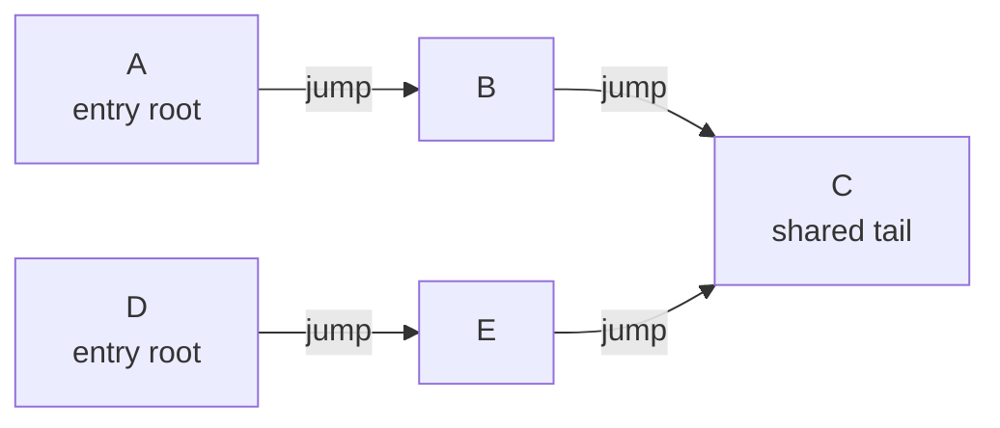
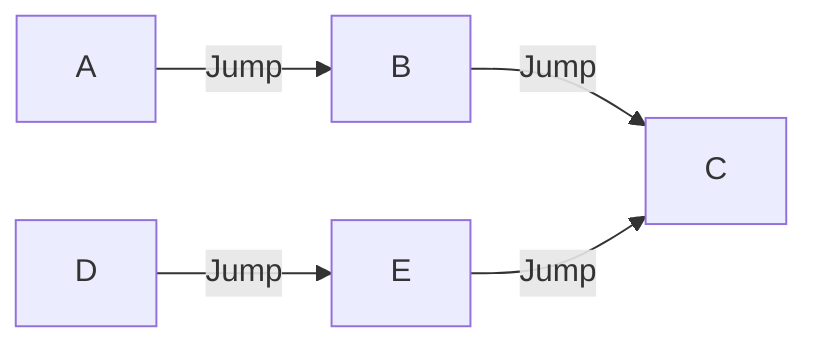
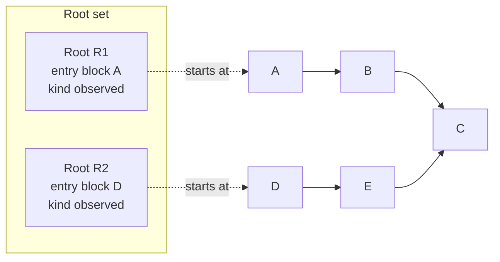
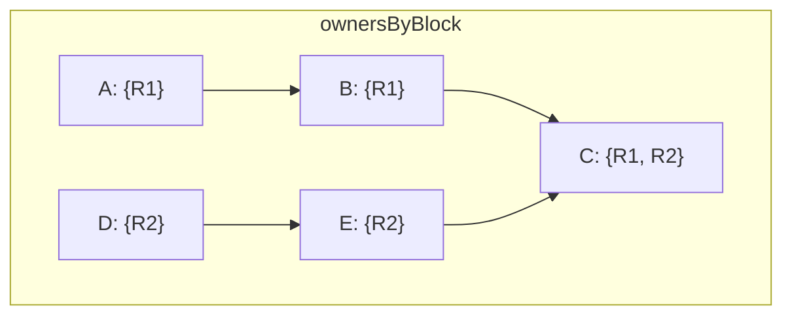
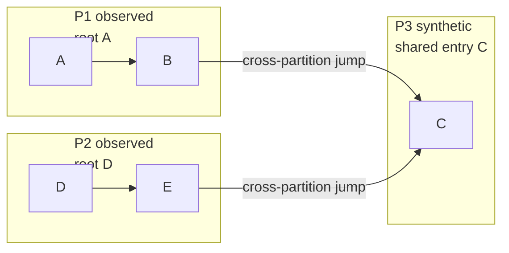
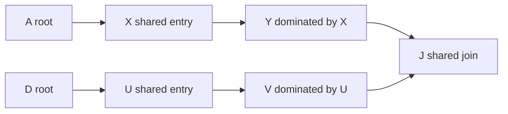
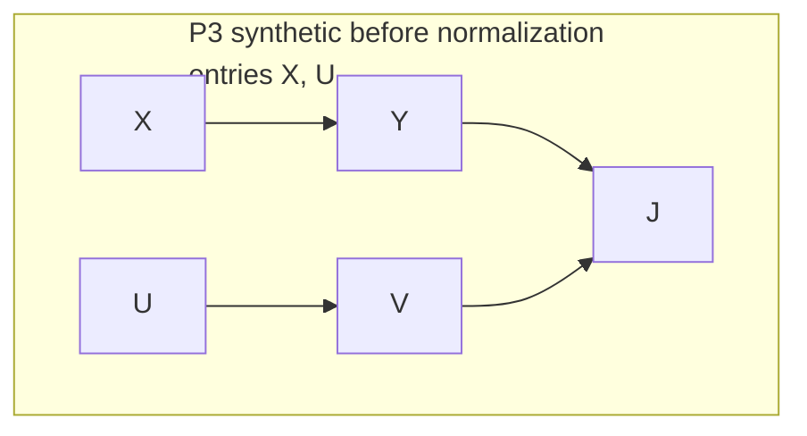
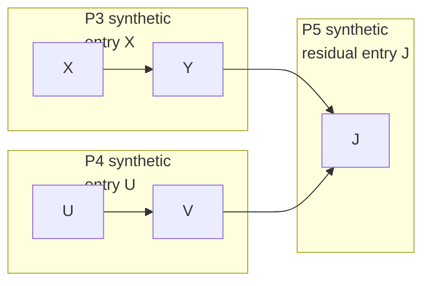
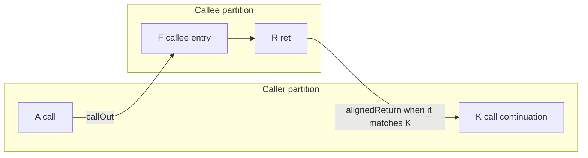

# CFG Function Partitioning

## Purpose

The CFG CPU records the actual control-flow graph discovered while executing x86 code. Function partitioning is a derived view over that graph. It groups CFG blocks into function-like regions, shared helper regions, and entry regions so the dump can be consumed by analysis tools or future code generation.

Partitioning does not permanently tag runtime CFG nodes with ownership. It runs after a graph has been exported and classifies the known blocks and edges conservatively.

The implementation lives in `Spice86.Core/Emulator/ReverseEngineer/FunctionPartitioning`.

## Input Graph

The partitioner starts from an exported `CfgBlockGraph`. It uses:

- CFG blocks and their contained instructions.
- Instruction-level successors from `CfgInstruction.SuccessorsPerType`.
- Execution-context entry points from `ExecutionContextManager`.
- Optional names from `FunctionCatalogue`.

It intentionally uses instruction-level successors rather than only block-level predecessor/successor arrays, because instruction successors preserve important control-flow meaning: calls, call continuations, CPU faults, jumps, and return targets.

## Pipeline

Partitioning is coordinated by `CfgFunctionPartitioner`. The pipeline turns a flat exported block graph into two related views:

- a list of partitions, where each exported block belongs to exactly one final partition;
- a list of transfers, where edges crossing partition boundaries are classified as calls, faults, returns, or jumps.

```mermaid
flowchart LR
	inputGraph["Exported CfgBlockGraph"] --> sort["1. Sort blocks<br/>and build block id index"]
	sort --> edges["2. Collect instruction-level<br/>edge records"]
	edges --> roots["3. Collect partition roots"]
	roots --> ownerless["4. Validate roots and reject<br/>ownerless blocks"]
	ownerless --> grow["5. Grow preliminary<br/>owner sets"]
	grow --> assemble["6. Assemble observed,<br/>entry, and synthetic drafts"]
	assemble --> normalize["7. Normalize multi-entry<br/>synthetic partitions"]
	normalize --> transfers["8. Annotate inter-partition<br/>transfers"]
	transfers --> result["CfgPartitionedProgram"]
```



The stages deliberately separate ownership from transfer semantics. Calls, faults, and returns are not used to grow the caller's ownership region. They are kept as boundary evidence and become transfers after each block has a final owner.

## Stage Example: Blocks A, B, C, D, E

The following small graph is used throughout the rest of this section. `A` and `D` are observed execution-context entries. Both eventually jump to the same tail block `C`.



The expected final shape is three partitions:

- `P1`, observed from root `A`, owns `A` and `B`.
- `P2`, observed from root `D`, owns `D` and `E`.
- `P3`, synthetic, owns shared block `C`.

### Stage 1: Edge Records

`CfgPartitionEdgeCollector` walks instructions inside every exported block and records edges between included blocks. It keeps the source block, target block, source node, target node, original successor type, and a partitioning classification.

For the example graph, all edges are ownership-preserving jumps:



At this stage there are no partitions yet. The partitioner only knows which block-to-block edges exist and what each edge means.

### Stage 2: Roots

`CfgPartitionRootCollector` creates roots from observed entry evidence:

- execution-context entry points become observed roots;
- call targets become observed function roots;
- CPU fault targets become observed execution-context roots.

At least one observed root is required for a non-empty graph. If root collection finds none, partitioning fails with an `InvalidOperationException`; a graph with no execution-context entry, call target, or CPU fault handler target does not contain enough evidence to partition safely. After this validation, the partitioner grows ownership from the roots and fails if any exported block is still ownerless. In a complete emulator export, every block should be explained by observed entry evidence or by an ownership-preserving predecessor; an ownerless block means the emulator/export path lost control-flow evidence and needs a fix.

In the example, roots are created for `A` and `D`:



### Stage 3: Preliminary Owners

`CfgPartitionRegionGrower` runs a graph walk from every root. It follows only ownership-preserving edges:

- `FallthroughOrInternal`
- `Jump`
- `CallContinuation`
- `MisalignedCallContinuation`

It stops at calls, CPU faults, return targets, and edges into a different root block. The output is not yet a block-to-partition assignment. It is a map from each block to all roots that can own it.

For the example, block `C` is reached by both roots:



A block with one owner can stay in that owner's observed or entry partition. A block with more than one owner is shared code and must be extracted so final partitions do not overlap.

### Stage 4: Assembly

`CfgPartitionAssembler` first creates one observed draft partition per root. Then it finds all shared blocks, groups connected shared blocks through ownership-preserving edges, and creates one synthetic draft partition for each connected shared component.

For the example, `C` becomes a synthetic partition:



Synthetic entries are chosen from shared blocks that are either root blocks or have ownership-preserving incoming edges from outside the shared component. If none exists, the first sorted shared block is used.

Ownerless blocks are rejected before assembly. The assembler still guards against ownerless input, but reaching that guard means the partitioner invariant was violated.

### Stage 5: Normalization

`CfgPartitionNormalizer` refines only synthetic partitions with multiple entry blocks. If the entries do not directly transfer to each other, it builds a dominator tree inside the synthetic partition and splits dominated regions into smaller single-entry synthetic partitions.

For a multi-entry shared component such as this:



Assembly may initially create one synthetic partition containing `X`, `Y`, `U`, `V`, and `J` with entries `X` and `U`:



Normalization can split that into three synthetic partitions:



This does not try to prove source-level functions. It only makes shared helper regions easier to consume by giving independent dominated regions their own entries.

### Stage 6: Transfers

After final block assignment, `CfgPartitionEdgeAnnotator` revisits the original edge records. Any edge whose source and target blocks now belong to different partitions becomes a transfer.



Return transfer classification is intentionally delayed until this stage. The annotator can compare return targets with observed call-continuation evidence and classify the boundary as `alignedReturn` when it matches normal call/return structure, or `dynamicReturn` when it does not.

## Edge Classification

`CfgPartitionEdgeCollector` classifies CFG instruction edges into behavior-oriented edge kinds:

| Edge kind | Meaning |
|---|---|
| `FallthroughOrInternal` | Ordinary local flow, including fallthrough and unremarkable normal edges. |
| `Call` | A call instruction entering its callee. |
| `CallContinuation` | The post-call continuation reached after an aligned return. |
| `MisalignedCallContinuation` | A post-call continuation reached after a suspicious or non-standard return. |
| `RetTarget` | A return instruction transferring to an observed return target. |
| `CpuFault` | A faulting instruction transferring to a CPU fault handler context. |
| `Jump` | A jump instruction transferring to its target. |

These are internal edge kinds used by the partitioner. They are later converted into serialized partition transfer kinds.

## Root Collection

A root is evidence that a block should start a partition.

Current root sources are:

- Execution-context entry points.
- Call targets.
- CPU fault handler targets.
- Dynamic return targets when no aligned call-continuation evidence exists.
- Self-contained graph components created by non-assembly control transfers, such as code override continuations.

The exported JSON also exposes `currentContextEntryPoint`, but that is execution metadata for the current CPU context. It is not a separate partition root source; during normal execution it is already present in the execution-context entry-point set.

If several pieces of evidence point to the same block, the partitioner keeps one root and records multiple entry records on it.

## How Blocks Are Clustered

`CfgPartitionRegionGrower` grows one preliminary ownership region from each root. It traverses only ownership-preserving edges:

- `FallthroughOrInternal`
- `Jump`
- `CallContinuation`
- `MisalignedCallContinuation`

It does not traverse:

- `Call`, because the callee should be a separate partition.
- `CpuFault`, because the handler is a separate execution context.
- `RetTarget`, because a return must first be classified as structured or dynamic.
- Edges into another root, unless the edge loops back to the same root.

At this stage a block can have more than one preliminary owner. That means it is shared code. `CfgPartitionAssembler` groups connected shared blocks into synthetic partitions. Non-shared blocks are assigned to the observed or entry partition that owns them.

By the end of assembly, every exported block belongs to exactly one serialized partition.

## Partition Kinds

Serialized partitions currently have one of these `kind` values:

| Kind | Meaning |
|---|---|
| `observed` | A partition rooted in observed runtime evidence, such as an execution context, call target, fault target, dynamic return target, or code-override graph component. |
| `synthetic` | A generated-code artifact for shared code reached from more than one owner. It does not necessarily correspond to an original source-level function. |

## Entries

Each partition has `entries`, the list of evidence explaining why this partition can be entered. Each entry record has:

| Field | Meaning |
|---|---|
| `block` | CFG block id containing the entry. |
| `address` | Segmented address of the entry evidence. |
| `kind` | Reason this address is considered an entry. |

Current entry kinds include:

| Entry kind | Meaning |
|---|---|
| `executionContextEntry` | Entry came from an execution context, such as startup or a fault/interrupt-like context. |
| `functionEntry` | Entry came from a call target. |
| `graphComponentEntry` | Entry came from a self-contained exported graph component, usually after non-assembly control flow such as a code override jump. |
| `returnTargetEntry` | Entry came from a return target that does not match aligned call-continuation evidence. |
| `sharedEntry` | Entry chosen for a synthetic shared partition. |

In short: `entries` records the observed evidence for entering the partition.

## Transfers

A transfer is an outgoing control-flow edge from one partition to another. Transfers are emitted from classified instruction edges whose source and target blocks belong to different partitions.

| Transfer kind | Meaning |
|---|---|
| `callOut` | A call from this partition into another partition. |
| `cpuFault` | A faulting instruction transfers to a CPU fault handler partition. |
| `alignedReturn` | A return whose target matches an observed call continuation. This behaves like a normal function return. |
| `dynamicReturn` | A return whose target does not match an observed call continuation. This behaves more like a stack-sourced jump. |
| `crossPartitionJump` | A non-call, non-fault, non-return transfer to another partition. |

Each transfer contains:

| Field | Meaning |
|---|---|
| `kind` | Serialized transfer kind. |
| `fromPartition` | Partition id that owns the source block. |
| `toPartition` | Partition id that owns the target block. |
| `fromBlock` | CFG block containing the source instruction. |
| `toBlock` | CFG block containing the target instruction. |
| `from` | Segmented address of the source instruction or CFG node. |
| `target` | Segmented address of the target CFG node, when known. |
| `callContinuationBlock` | CFG block for an observed call continuation, when the transfer is a call with known continuation. |
| `callContinuationAddress` | Segmented address of that call continuation, when known. |

The top-level `transfers` list is the canonical graph-wide transfer list. Per-partition calls, exits, flags, and representation hints are intentionally not serialized by the partitioner; generator-owned analysis can derive those projections from `transfers` when needed.

## Why Transfers Use Segmented Addresses

The dump uses segmented addresses such as `F000:1000` because the executed program is real-mode x86. The active `CS:IP` form matters for reverse engineering and for reproducing control flow.

A linear address alone is not always enough. Different `segment:offset` pairs can refer to the same physical address, and the emulator often needs to preserve the exact segmented form that was executed.

In a transfer:

- `from` is the segmented address of the source instruction or CFG node that caused the transfer.
- `target` is the segmented address of the destination CFG node.

For example, in the `div` CPU test, the main code faults on division instructions and enters the handler at `F000:1000`. The handler ends at `F000:101A` with `iret`, which returns to different segmented addresses in the main code.

## Naming

Names are provided by `CfgPartitionNameProvider`.

If `FunctionCatalogue` contains a `FunctionInformation` at the partition entry address, that information is used as the label.

Otherwise the partition is named with this deterministic fallback:

```text
unknown_SEGMENT_OFFSET_LINEAR
```

For example:

```text
unknown_F000_1000_F1000
```

The name is only a display label. It is not used as structural proof that the partition is a real function.

## Example: `div` CPU Test

The `div` test listing has ordinary test code from `F000:0000` and a fault handler at `F000:1000`:

```text
F000:1000 push AX
...
F000:101A iret
F000:FFF0 jmp short 0
```

The main test code intentionally executes `div`, `idiv`, and `aam` cases that can fault. The CFG therefore contains CPU fault edges from many main-code blocks to the handler block at `F000:1000`.

The partitioner produces two main partitions:

- The handler partition rooted at `F000:1000`, with `executionContextEntry` evidence.
- The main execution partition rooted at `F000:FFF0`, also with `executionContextEntry` evidence.

The main partition has `cpuFault` transfers to the handler partition. The handler partition has `dynamicReturn` transfers back to several continuation addresses in the main partition, because `iret` returns to observed targets that are not normal call continuations.

That is why this dump shows:

- `cpuFault` transfers from main code to `F000:1000`.
- `dynamicReturn` transfers from `F000:101A` back into main code.
- No partition-level representation hints; generator analysis is responsible for deciding how to lower those transfers.