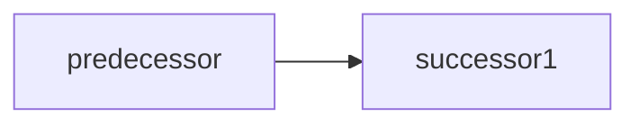
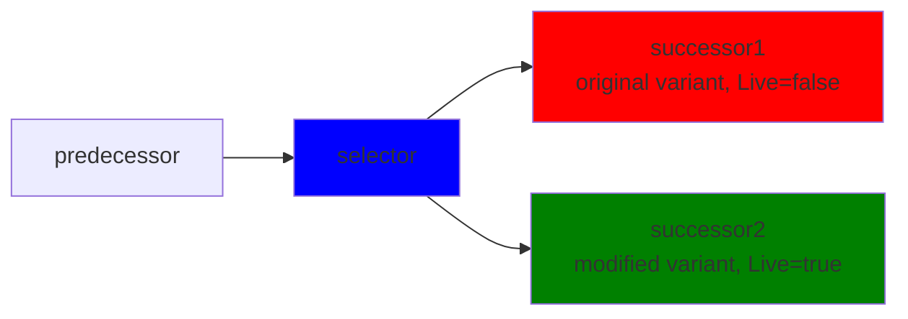

# CFG CPU - Control Flow Graph CPU Implementation

## Overview

The CFG CPU (Control Flow Graph CPU) is a CPU emulation implementation that builds and maintains a dynamic Control Flow Graph of executed instructions.

Goal is to enable code generation from execution traces. CFG CPU helps by providing enhanced execution tracking, especially for self-modifying code detection, and somehow reliable context management for hardware interrupt handling.

The CFG CPU addresses these challenges by recording execution as a **Control Flow Graph** during emulation, enabling:
- **Complete Execution Flow Recording**: Captures actual program execution paths as they happen
- **Self-Modifying Code as Graph Branches**: Represents code variants as different nodes in the graph
- **Instruction Variant Tracking**: Records all observed variants of instructions at each memory address
- **Context-Aware Analysis**: Doesn't link hardware interrupt calls with regular program flow

With persistent knowledge of instruction relationships and execution patterns, oportunities to optimize (JIT) blocks of code are becoming possible

## Architecture Overview
### Graph Management

#### Node Types

1. **CfgInstruction**: Regular assembly instructions parsed from memory
2. **SelectorNode**: Special nodes that handle self-modifying code by selecting the correct instruction variant at runtime

#### Graph Construction

The CFG is built dynamically during execution:

1. **Initial Node Creation**: Instructions are parsed from memory and converted to CFG nodes
2. **Dynamic Linking**: As instructions execute, successor relationships are established
3. **Self-Modification Detection**: When memory content differs from graph nodes, selector nodes are injected
4. **Context Separation**: Different execution contexts maintain separate graph segments

#### Graph Coherency

The system maintains coherency between the graph and memory through several mechanisms:

##### Live Node Checking
- Nodes are marked as "live" when they match the current memory state
- Non-live nodes trigger memory re-parsing and potential graph updates

##### Signature Reduction
- When multiple instruction variants exist at the same address, the system attempts to reduce them to a single canonical form
- If reduction fails, a selector node is created to handle runtime selection

##### Node Replacement
- Instructions can be replaced in the graph while maintaining predecessor/successor relationships
- Entry points are updated when instructions are replaced

#### Instruction Management

##### Instruction Creation
Each instruction is represented as a node in the **Control Flow Graph** with the following characteristics:

- **Unique Identity**: Each instruction has a numeric ID, a segmented address, and a signature
- **Signature System**: The signature contains the final bytes of the instruction - bytes that, if changed by code, will require a new instruction to be inserted in the graph with a selector node
- **Address Sensitivity**: Instructions are not considered equal if segment:offset differs. Even if the linear address is the same, if the segmented address changes, a new node will be created

##### Instruction Linking
Instructions maintain connectivity through predecessor and successor relationships:

- **Dynamic Linking**: When the CPU moves from one instruction to another in the same context, it creates a link
- **Return Linking**: A link is also created when a function return is detected to link the corresponding call instruction to the return address
- **Context Awareness**: Links are only created within the same execution context

If hardware interrupt happen (timer, keyboard, DMA, ...), context is switched and graph is not threaded from the current instruction, but starts from the entry point of the interrupt handler instead. This means the CFG graph can be disconnected and have several islands.

#### Self-Modifying Code Detection and Handling

##### Detection Mechanism

Self-modifying code is detected when:
1. A graph node exists for an address
2. The memory content at that address differs from the node's representation
3. The differing node (marked as non live) is executed

When instruction bytes are modified by the program, nothing happens initially. However, when this modified area is executed, the emulator detects that the nodes in the graph are not coherent with memory.

##### Handling Strategy

The system handles self-modifying code through different strategies based on what was modified:

**Non-Final Byte Modifications:**
- If modified bytes were part of a field that is considered as non-final, the instruction is marked as having this field read from memory instead of from the parsed instruction
- For example, if the `1234` part of `MOV AX, 1234` is modified, we just record that the value should be read from memory

**Final Byte Modifications:**
- If final bytes are modified and an existing instruction is linking to the modified instruction, a new instruction is created and a selector node is inserted in the graph:

**Before modification:**

**Modification occurs:** `successor1` is modified to `successor2` in memory (for example JA modified to JBE)

**After modification:**

**Selector Node Operation:**
1. **Selector Node Creation**: A special selector node is created at the address
2. **Runtime Selection**: The selector node chooses the correct instruction variant during execution by comparing signatures
3. **Graph Preservation**: Both the original and modified instruction nodes are preserved
4. **Predecessor Linking**: All predecessors are redirected to point to the selector node, but successors are not.

Selector nodes map signatures to instructions - each time they are executed, they know which path to take in the graph by comparing the signatures of the instructions with what is in memory.

### Execution Flow

1. **Node Selection**: `CfgNodeFeeder` determines the next node to execute
2. **Coherency Check**: Verifies the selected node matches memory content if needed
3. **Linking**: Links the current node to the previously executed node if needed
4. **Execution**: Executes the selected node
5. **Graph Update**: Updates graph state based on execution results
6. **Context Management**: Handles any context switches due to hardware interrupts

## Context Management

### Execution Contexts

Each execution context represents a separate execution environment with:
- **Entry Point**: Starting address for the context
- **Depth**: Nesting level (0 for main execution, higher for interrupts)

### Context Switching

Context switches occur during:
- **External Interrupts**: Hardware interrupts create new contexts
- **Context Restoration**: Returning from interrupts restores previous contexts

### Context Restoration

The system maintains a stack of contexts to restore:
- Each new context records its expected return address
- When execution reaches a return address, the corresponding context is restored
- Context depth is properly maintained during restoration

## Core Classes

#### `CfgCpu`
The main CPU implementation that orchestrates the entire CFG system:
- Implements `IInstructionExecutor` for instruction execution
- Manages the discovery and execution of the nodes in the graph, and handles external interrupt handling
- Coordinates between different subsystems (feeder, context manager, instruction executor)

#### `ICfgNode` Interface
Represents nodes in the control flow graph:
- **Properties**:
  - `Id`: Unique identifier for the node
  - `Address`: Memory address of the instruction
  - `Predecessors`/`Successors`: Graph connectivity
- **Methods**:
  - `Execute()`: Executes the node's instruction
  - `ToInstructionAst()`: Converts to Abstract Syntax Tree representation

#### `ExecutionContextManager`
Manages hierarchical execution contexts for hardware interrupt handling:
- Maintains a stack of execution contexts
- Handles context switching for external interrupts
- Manages entry points for different execution contexts
- Provides context restoration when returning from interrupts

#### `CfgNodeFeeder`
Ensures coherency between memory and the instruction graph:
- Fetches instructions from memory when needed (may call the parser if node is new)
- Detects discrepancies between graph and memory (self-modifying code)
- Creates selector nodes for handling multiple instruction variants
- Links nodes in the execution graph

#### `InstructionParser`
Parses memory into instruction nodes.
Each variant of an instruction is a separate C# type.
Part of the instructions are generated from templates via https://github.com/mrpmorris/Morris.Moxy
Instructions are composed of a list of fields. Each field can be:
- **Final** In that case value is always read from the parsing result
- **Non Final** In that case value is initially read from parsing result unless the field has been detected as modified post parsing, in that case value is read from memory.