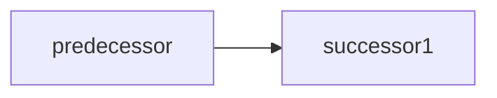
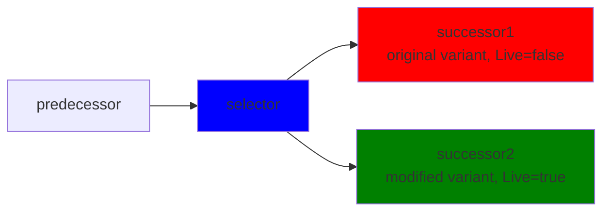

# CFG CPU

## Overview

The CFG CPU builds a Control Flow Graph of x86 instructions as it executes them. The primary goal is to produce execution traces suitable for code generation, with particular attention to self-modifying code and hardware interrupt isolation.

By recording execution as a graph, the system captures:
- Actual program paths as they happen
- All observed instruction variants at each address (self-modifying code becomes graph branches)
- Clean separation between regular program flow and interrupt handlers

This also opens the door to JIT-compiling hot blocks in the future.

## Node Types

### CfgNode

Base class for all graph nodes. Each node tracks its predecessors, successors, and whether it's still live (i.e. matches what's currently in memory). `MaxSuccessorsCount` caps the expected outgoing edges - 1 for sequential flow, 2 for conditional jumps, `null` for computed jumps with an unknown number of targets. Once the cap is reached, the linker stops trying to add edges. When `MaxSuccessorsCount` is 1, the sole outgoing edge is cached in `UniqueSuccessor` for a fast path.

### CfgInstruction

A parsed x86 instruction. `CfgInstruction` is a flat data carrier - the parser determines semantics at parse time and stores pre-built ASTs directly on it. Beyond the base node properties:

| Property | Purpose |
|---|---|
| `FieldsInOrder` | Ordered `FieldWithValue` list covering every byte of the instruction |
| `Signature` | Full byte signature (`null` entries are wildcards for variable fields) |
| `SignatureFinal` | Signature restricted to final fields only - the instruction's structural identity |
| `SuccessorsPerAddress` | Maps target `SegmentedAddress` to its successor node |
| `SuccessorsPerType` | Maps `InstructionSuccessorType` to a set of successors |
| `Length` / `NextInMemoryAddress` | Instruction size and fall-through address |
| `DisplayAst` | Pre-built `InstructionNode` for display (mnemonic + operands) |
| `ExecutionAst` | Pre-built `IVisitableAstNode` compiled into an executable delegate |
| `Kind` | `InstructionKind` flags: `Call`, `Jump`, `Return`, `Invalid` |

### SelectorNode

When self-modifying code produces multiple variants at the same address and they can't be merged, a `SelectorNode` sits between predecessors and the variants. It holds a `Dictionary<Signature, CfgInstruction>` and picks the right one at runtime by reading memory.

```
 Predecessor A ──→ SelectorNode(0x1000) ──→ Variant 1 (mov ax, bx)
 Predecessor B ──→                      ──→ Variant 2 (add ax, cx)
```

A `SelectorNode` is always considered live - it can't go stale because it reads memory every time.

## Signatures and Fields

### Signature

An `ImmutableList<byte?>`. Concrete bytes must match exactly; `null` bytes are wildcards. Two signatures are equal when every position is either both `null` or both the same value. `ListEquivalent(IList<byte>)` tests whether actual memory bytes match a signature.

### FieldWithValue

Every byte range of a parsed instruction is wrapped in a `FieldWithValue`:

- `PhysicalAddress` - location in memory.
- `Final` - if true, a change here means a structurally different instruction (e.g. opcode bytes). If false, the instruction is the same shape with different data (e.g. an immediate operand).
- `UseValue` - when true, the cached parse-time value is used at execution. When false, the value is re-read from memory because self-modifying code has been observed changing it.

The final vs. non-final distinction is what makes variant merging possible.

### InstructionParser

Turns memory into `CfgInstruction` nodes. The parser is the single source of truth: it reads bytes, determines semantics, builds both ASTs (display and execution) using `AstBuilder`, and attaches them to a flat `CfgInstruction` via `AttachAsts()`. Construction follows a two-phase pattern: fields are registered first (so `NextInMemoryAddress` is computed), then ASTs are built using the complete instruction.

Each instruction is a list of fields where:
- Final fields always use the parsed value.
- Non-final fields use the parsed value initially, but switch to reading from memory once a post-parse modification is detected.

Non-final fields are represented in the AST as `InstructionFieldNode`, which defers the constant-vs-memory-read decision to visit time based on `UseValue`. This means ASTs are structurally stable and never need rebuilding when `SignatureReducer` marks a field for live reads.

## Graph Construction

The graph grows at runtime:

1. Instructions are parsed from memory into `CfgInstruction` nodes.
2. As execution proceeds, successor edges are added between nodes.
3. When memory no longer matches a graph node, selector nodes are injected.
4. Separate execution contexts (see below) keep their graph segments independent.

## Instruction Caching

`InstructionsFeeder` maintains a two-tier cache:

```
GetInstructionFromMemory(address)
 │
 ├── CurrentInstructions hit? → return it
 │
 └── miss → GetFromPreviousOrParse(address)
              │
              ├── PreviousInstructions has a variant matching current memory? → promote, return
              │
              └── miss → parse from memory
                          │
                          ├── SignatureReducer can merge with an existing variant? → return merged
                          │
                          └── store in both caches, return
```

`CurrentInstructions` is the authoritative "what's in memory right now" map - exactly one instruction per address, evicted by memory-write breakpoints.

`PreviousInstructions` keeps every variant ever seen at an address (a `HashSet<CfgInstruction>` per address). When an instruction is evicted from current, it stays here. If the program later restores the original bytes, the same object is reused - preserving all its graph edges.

## Node Linking

### NodeLinker

After picking the next node to execute, `CfgNodeFeeder` calls `NodeLinker.Link(type, lastExecuted, toExecute)` provided the last node can still accept successors. `Link` returns the resolved node, which may differ from `toExecute` when a `SelectorNode` gets injected to resolve a conflict.

Link types:

| Type | Meaning |
|---|---|
| `Normal` | Sequential or jump-target transition |
| `CallToReturn` | Return from a call lands at the instruction after the call |
| `CallToMisalignedReturn` | Return lands elsewhere (tail call, longjmp, etc.) |
| `CpuFault` | Transition caused by an exception/interrupt |

How linking resolves, depending on node types:

- **CfgInstruction → CfgInstruction** - look up `SuccessorsPerAddress[next.Address]`. Missing? Create the link. Present but a different object? That's a successor conflict (see below).
- **SelectorNode → CfgInstruction** - look up `SuccessorsPerSignature[next.Signature]`. Missing? Create the link. Present but a different object? Throw.
- **Return instruction** (`IsReturn` flag) - also links the original call instruction to the return target (`CallToReturn` or `CallToMisalignedReturn`). Only the ret→next resolution is returned; the call→next link is bookkeeping.

Links are only created within the same execution context. When a hardware interrupt fires (timer, keyboard, DMA, ...), a new context starts from the interrupt handler's entry point. The graph is never threaded across that boundary, so it can be disconnected - multiple islands are normal.

### Successor Conflict Resolution

When a `CfgInstruction` already has a successor at `next.Address` but it points to a different object:

1. If the existing successor is already a `SelectorNode`, just add `next` to it.
2. Otherwise, create a new `SelectorNode` between the two via `CreateSelectorNodeBetween`.

This catches self-modifying code detected at link time - for instance, a CALL whose return target was rewritten between the call and the ret.

### InsertIntermediatePredecessor

Used when creating a `SelectorNode`. Rewires predecessors so they go through the selector:

```
Before:  PredA → Instruction1      PredB → Instruction2
After:   PredA → SelectorNode → Instruction1
         PredB → SelectorNode → Instruction2
```

## Self-Modifying Code Detection and Handling

### Memory Write Breakpoints

When an instruction becomes the current one at its address (`CurrentInstructions.SetAsCurrent`), a `MEMORY_WRITE` breakpoint is registered for every byte with a non-null signature value. Wildcard bytes don't get breakpoints - changes there are expected and don't invalidate anything.

When the CPU writes to a monitored byte and the new value differs from the old, `ClearCurrentInstruction` fires: breakpoints are unregistered, the instruction is evicted from `CurrentInstructions`, and `IsLive` is set to false. The instruction stays in `PreviousInstructions`.

### Graph Reconciliation at Execution Time

When the CPU needs the next node (`CfgNodeFeeder.GetLinkedCfgNodeToExecute`):

```
DetermineToExecute(executionContext)
 │
 ├── nodeFromGraph == null          → fetch via GetInstructionFromMemoryAtIp()
 ├── nodeFromGraph.IsLive == true   → use it directly
 └── nodeFromGraph.IsLive == false  → ReconcileGraphWithMemory
      │
      ├── GetInstructionFromMemoryAtIp() (may trigger SignatureReducer as a side-effect)
      │       │
      │       └── If reducer merges the stale node into fromMemory, it fires
      │           InstructionReplacerRegistry → ExecutionContextManager.ReplaceInstruction
      │           → updates executionContext.NodeToExecuteNextAccordingToGraph to fromMemory
      │
      ├── After parsing, check executionContext.NodeToExecuteNextAccordingToGraph:
      │     ├── Same reference as fromMemory? → reconciliation succeeded (merged), return it
      │     └── Different reference? → genuinely different instructions, inject SelectorNode
      │
      └── SelectorNode creation delegates to NodeLinker.CreateSelectorNodeBetween
```

Note that `CfgNodeFeeder` never calls `SignatureReducer` directly. Reduction happens as a side-effect of `InstructionsFeeder.GetInstructionFromMemory` → `ParseEnsuringUnique` → `SignatureReducer.ReduceToOne`. When a reduction succeeds, it propagates through `InstructionReplacerRegistry`, which notifies `ExecutionContextManager` to update `NodeToExecuteNextAccordingToGraph` in the current context (and all stacked ones). `ReconcileGraphWithMemory` then just checks whether that propagation resolved the stale reference.

### Handling Strategy

What happens depends on which bytes were modified:

**Non-final bytes changed:** The instruction survives. The modified field is marked "read from memory" instead of using its cached value. For example, if the `1234` in `MOV AX, 1234` is overwritten, we just switch that field to live reads.

**Final bytes changed:** The instruction's identity is different now. If another node was already linked to it, a `SelectorNode` is inserted:

**Before modification:**

```mermaid
flowchart LR
    P[predecessor] --> S1[successor1]
```

**Modification occurs:** `successor1` is overwritten with a different instruction in memory (e.g. JA replaced by JBE)

**After modification:**

```mermaid
flowchart LR
    P[predecessor] --> SEL[selector]
    SEL --> S1[successor1<br/>original variant, Live=false]
    SEL --> S2[successor2<br/>modified variant, Live=true]
    
    %% Styling
    classDef original fill:red
    classDef modified fill:green
    classDef selector fill:blue
    class S1 original
    class S2 modified
    class SEL selector
```

### SelectorNode Creation and Execution

`NodeLinker.CreateSelectorNodeBetween(instruction1, instruction2)` creates a `SelectorNode` at the shared address and calls `InsertIntermediatePredecessor` for both instructions, rewiring all their predecessors to go through the selector.

At runtime, `GetNextSuccessor()` iterates `SuccessorsPerSignature`, reads the corresponding bytes from memory, and returns the first matching variant - or `null` if nothing matches, triggering a fresh parse.

## Variant Merging (SignatureReducer)

When two `CfgInstruction` objects at the same address share the same `SignatureFinal` - same opcodes, same structure, differing only in non-final fields - they can be merged into one node:

1. Group instructions by `SignatureFinal`.
2. Pick the first instruction in each group as the reference.
3. Compare field values across all instructions in the group.
4. Where a field differs: set `UseValue = false` and `NullifySignature()` on the reference's field, turning it into a wildcard that reads from memory at execution time.
5. Discard the redundant instructions via `InstructionReplacerRegistry`, which updates all caches and graph edges to point at the reference.

This is the key optimization. An instruction like `mov ax, <imm>` where the immediate keeps changing via self-modifying code stays as a single graph node with the immediate field marked "read from memory."

## Instruction Replacement (Observer Pattern)

When a `CfgInstruction` is merged or replaced (typically by `SignatureReducer`), every cache and graph structure must stay consistent. `InstructionReplacerRegistry` handles this - each component registers itself at construction time and gets notified on `ReplaceInstruction(old, new)`:

- `CurrentInstructions` - evicts the old entry, installs the new one with fresh breakpoints.
- `PreviousInstructions` - swaps old for new in the historical set.
- `NodeLinker` - rewires predecessor/successor edges and merges `SuccessorsPerType`.
- `ExecutionContextManager` - updates entry point tracking and `NodeToExecuteNextAccordingToGraph` in all execution contexts (current + stacked).

### Stale Reference Propagation

When `SignatureReducer` merges two variants, every execution context still referencing the old instruction must be patched. `ExecutionContextManager.ReplaceInstruction` walks the current context and all stacked ones (via `ExecutionContextReturns.GetAllContexts()`), updating `NodeToExecuteNextAccordingToGraph` everywhere. Without this, a stacked context - say,  a hardware interrupt that paused mid-CALL - could resume with a stale reference and silently miss the merge.

## Execution Flow

At each step:

1. `CfgNodeFeeder` picks the next node to execute.
2. If the node might be stale, it's checked against memory.
3. The node is linked to the previously executed one (if the predecessor still has room).
4. The node's compiled execution delegate runs (compiled from the pre-built `ExecutionAst` by `CfgNodeExecutionCompiler`).
5. Graph state is updated.
6. If a hardware interrupt arrived, context is switched.

## Context Management

### Execution Contexts

An `ExecutionContext` tracks graph state within a single flow of control:

- `EntryPoint` - where the context started (e.g. an interrupt vector).
- `LastExecuted` - the most recently executed node.
- `NodeToExecuteNextAccordingToGraph` - what the graph thinks comes next (may be stale).
- `CpuFault` - whether the last execution triggered a fault.
- `Depth` - nesting level (0 for the main program, incremented for interrupts).

`ExecutionContextManager` pushes a new context on hardware interrupts and pops it on return, keeping CFG tracking independent per nesting level. Each context records its expected return address; when execution reaches that address, the corresponding context is restored and depth decremented.

## End-to-End Example: Self-Modifying Code

```
1. INITIAL PARSE
   Address 0x1000 contains: B8 05 00  (mov ax, 5)
   → CfgInstruction parsed, stored in CurrentInstructions + PreviousInstructions
   → Memory-write breakpoints installed on bytes at physical addresses for B8, 05, 00

2. CODE MODIFIES ITSELF
   CPU executes: mov [0x1001], 0x0A    (changes immediate from 05 to 0A)
   → Write breakpoint at 0x1001 fires
   → OnBreakPointReached: current byte (05) ≠ new byte (0A)
   → ClearCurrentInstruction: breakpoints removed, evicted from cache, IsLive = false
   → Instruction stays in PreviousInstructions

3. NEXT EXECUTION AT 0x1000
   CfgNodeFeeder.DetermineToExecute → ReconcileGraphWithMemory:
     nodeFromGraph.IsLive == false → self-modifying code detected
     GetInstructionFromMemoryAtIp() triggers InstructionsFeeder.GetInstructionFromMemory(0x1000):
       → CurrentInstructions miss
       → PreviousInstructions: old signature [B8, 05, 00] ≠ memory [B8, 0A, 00] → no match
       → ParseEnsuringUnique: parse B8 0A 00 (mov ax, 10)
       → SignatureReducer: old SignatureFinal = [B8, null, null], new = [B8, null, null] → SAME
       → Merge: keep old node, mark immediate field UseValue=false, NullifySignature
       → InstructionReplacerRegistry fires → ExecutionContextManager patches all contexts
     Back in ReconcileGraphWithMemory:
       → NodeToExecuteNextAccordingToGraph now == fromMemory → reconciliation succeeded
       → Result: single node with signature [B8, null, null], reads immediate from memory

4. GRAPH RESULT
   One CfgInstruction at 0x1000 with a wildcard immediate field.
   No SelectorNode needed - variant merging absorbed the change.

5. ALTERNATIVE: DIFFERENT OPCODE
   If 0x1000 changes from B8 05 00 (mov ax, 5) to 01 C8 (add ax, cx):
   → SignatureFinal differs → cannot merge
   → SelectorNode created at 0x1000, predecessors rewired
   → At runtime, selector reads bytes and dispatches to the matching variant
```

## Design Decisions

- **Breakpoint-based invalidation** over checking memory on every fetch - keeps the hot path fast when code isn't changing.
- **Two-tier cache** (current + previous) so that restoring original bytes reuses the original node with all its edges intact, rather than creating duplicates.
- **Variant merging** minimizes SelectorNode creation. Most self-modifying code only touches operands (non-final fields), not opcodes.
- **Null wildcards in signatures** give a uniform matching mechanism that works for both merged instructions and SelectorNode dispatch.
- **Observer-based replacement** (`InstructionReplacerRegistry`) keeps caches and graph consistent when nodes are merged, without coupling components.

## Core Classes

#### `CfgCpu`
The top-level CPU that orchestrates the CFG system. Implements `IInstructionExecutor`, drives node discovery and execution, handles external interrupts, and coordinates the feeder, context manager, and instruction executor.

#### `ExecutionContextManager`
Manages the stack of execution contexts for hardware interrupts - pushing on entry, popping on return, tracking entry points, and ensuring context restoration.

#### `CfgNodeFeeder`
The bridge between memory and the graph. Fetches instructions (parsing if needed), detects memory/graph discrepancies, injects selector nodes for multiple variants, and links nodes during execution.