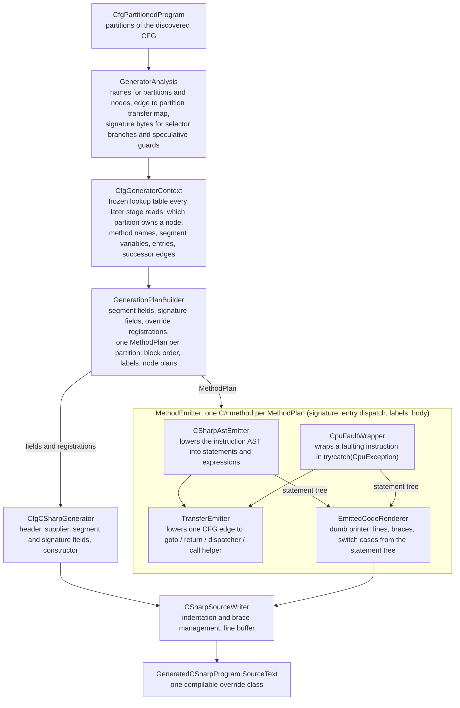

# C# Code Generator

Turns a discovered CFG (control flow graph) into a compilable C# override class that replaces the emulated assembly at runtime.

## What it does

After Spice86 runs a DOS program, it has a complete CFG of every instruction that executed. The generator takes that graph and produces a `.cs` file where each function partition becomes a C# method - gotos instead of jumps, method calls instead of `CALL`, typed register access instead of raw bytes.

## Pipeline overview

`CfgCSharpGenerator.Generate` runs these stages:



## Key concepts

### Partition = Method

The CFG is split into partitions (groups of blocks that form a logical function). Each partition becomes one C# method. Transfers between partitions become `return OtherMethod(loadOffset);`.

### Plan then write

The generator works in two phases:
1. **Plan** - decide everything up front (method order, labels, entry dispatch, segment fields)
2. **Write** - walk the plan and emit code mechanically, no re-analysis needed

The plan built by `GenerationPlanBuilder.Build` holds, per program: the segment fields, the override registrations and the signature fields (`SignatureFieldPlan`, one `private static readonly byte?[]` per instruction whose bytes are re-read at runtime). Per method (`MethodPlan`): a `PartitionBlockGraph` (`MethodPlan.BlockGraph`), a `DepthFirstOrdering<CfgBlock>` (`MethodPlan.BlockTraversal`), the block order, one `NodeEmissionPlan` per node (carrying `EmitsExternalEventCheck` and `EmitsExternalEventCheckAfter`), the label names and the local variable suffixes.

`MethodEmitter.Emit` then works over that plan like this:
1. lower every node into an `EmittedCode` (a statement tree), without writing any text;
2. collect the goto targets: every `GotoStatement.Target` found with `StatementWalker.Descendants`, and whether a `GotoEntryDispatcherStatement` exists (in which case the `entrydispatcher:` label is written);
3. render: write a label only for nodes that are goto targets, then render each node.

`MethodEmitter` throws `InvalidOperationException` when the last emitted node of a method can still complete normally, because such a body would fall off its end.

### Block layout

Blocks are emitted in reverse post-order of a depth-first traversal that starts at the primary entry block (`GenerationPlanBuilder.BuildMethodPlan`). Successors are visited non-fallthrough first, in descending address order, and the fallthrough successor last (`GenerationPlanBuilder.LayoutSuccessors`), so the fallthrough block is usually placed right after its predecessor and needs no `goto`. The primary entry is always the first emitted node, so a single-entry method needs no jump at its start.

### Statement tree

The intermediate representation between lowering and printing, one record per C# statement shape in `Model/Statement/`:

| record | what it is |
|---|---|
| `LineStatement` | one source line; `Diverges` marks `return` / `goto` / `throw` lines that never fall through |
| `BlockStatement` | a braced block with a header, e.g. `while (...)` or an `if` with no `else` |
| `SwitchStatement` / `SwitchCase` | a `switch` over runtime-dispatched values with one body per case |
| `GotoStatement` | a same-method jump to a target node; the label text is resolved at render time |
| `GotoEntryDispatcherStatement` | a jump back to the method's entry dispatcher (cyclic cross-partition re-entry) |
| `IfElseStatement` | an `if` with an optional `else`; the `else` is rendered only when the false body is non-empty |
| `TryCatchStatement` | a `try` body plus one `catch` block with a full header |

`StatementItem.NestedBodies` plus `StatementWalker.Descendants` is how a pass finds nested statements without knowing the concrete record. The tree is transitional: it is meant to be replaced by one AST per method, so do not add new semantic fields or new analysis passes to it.

### Edge lowering

Every jump/call/return in the original assembly becomes a "resolved CFG edge" - a source node, a target node, and metadata about what kind of transfer it is. The `TransferEmitter` turns each edge into the appropriate C# construct:

| Edge kind | Generated C# |
|-----------|-------------|
| Same method, next node | *(nothing - fallthrough)* |
| Same method, other node | `goto L_0009;` |
| Cross-partition | `return OtherMethod(0x0000);` |
| Cyclic cross-partition flow | `if (JumpDispatcher.Jump(unknown_F000_0025_F0025, 0x0000)) { loadOffset = JumpDispatcher.NextEntryAddress; goto entrydispatcher; }` then `return JumpDispatcher.RequiredJumpAsmReturn;` |
| Near/far call | `NearCall(cs1, 0x00CC, unknown_F000_0200_F0200);` / `FarCall(cs1, 0x000D, cs2, unknown_F100_0000_F1000);` plus the observed post-call continuation |
| Return | `return NearRet();` when the `ret` has no operand, `return NearRet(0x000A);` when it has one, `return FarRet();` for `retf` |

### External event checks

`CheckExternalEvents(cs, ip)` tells the emulator to deliver pending interrupts and advance emulated time. It is emitted in exactly three places:

1. at the entry of every method entry block; for an entry that sits in the middle of a block, inside its `switch (loadOffset)` case, before the `goto` (`MethodEmitter.EmitEntryDispatch` / `MethodEmitter.EntryEventCheck`);
2. at the entry of every block that is the target of a retreating edge of the layout traversal (loop heads), so every repeating path passes a check;
3. after the body of an instruction that may enable interrupts (`sti`, `popf`, `popfd`), detected on the instruction AST by `InterruptEnableDetectorVisitor` (`sahf` does not count), unless its fallthrough block already checks at its entry.

The two flags that decide this are precomputed per node in `GenerationPlanBuilder.BuildMethodPlan` as `NodeEmissionPlan.EmitsExternalEventCheck` and `NodeEmissionPlan.EmitsExternalEventCheckAfter`. Straight-line code that has none of these three points gets no check, on purpose: emulated time only matters in loops.

### Helpers used by generated code

The generated class derives from `CSharpOverrideHelper`, which provides:

- `DispatchCpuFault(cpuException, cs, ip, [new CpuFaultTarget(...)])` in the `catch` of a faulting instruction;
- `Div8` / `Div16` / `Div32` / `IDiv8` / `IDiv16` / `IDiv32`, each returning `(Quotient, Remainder)`, for example `(AX, DX) = Div16(divisor: CX, dividend: ...);`;
- `In8` / `In16` / `In32` and `Out8` / `Out16` / `Out32` for port I/O;
- `SelectorSignatureMatches` and `VerifySpeculativeEntryOrFail`, which read the `Signature_...` fields;
- `FailAsUntested`, which throws on a path discovery never observed;
- `CheckExternalEvents`, the delivery point described above.

### Naming

Labels are `L_<offset>` (for example `L_0003`), unique per method; the node id is appended only when two nodes of the method share an offset (self-modifying code). Temps use the instruction offset as suffix, per method, with the same collision rule (for example `popDestinationCheck_0073`). Signature fields are `private static readonly byte?[] Signature_<offset>_<mnemonic>` (for example `Signature_0019_jne`), one per instruction, same collision rule. The mnemonic comes from `InstructionMnemonic`, and the collision rule itself is `DisambiguatedNames.Build`, called from `GenerationPlanBuilder` for labels and local suffixes and from `GeneratorAnalysis` for signature fields. Every `throw FailAsUntested(...)` line comes from `UntestedMessages`, one method per kind: `Jump`, `ConditionalFallthrough`, `FallthroughAfter`, `IndirectWithoutTargets`, `NearTarget`, `FarTarget`, `CodeVariant`, `ReturnFromCall`, `CpuFaultTarget`, `EntryOffset`.

### Untested paths

If an edge was never traversed during discovery, the generated code throws `FailAsUntested(...)` at that point. This makes it safe to run the generated code: it either does exactly what was observed, or fails loudly on an unobserved path.

### CPU fault handling

Instructions that triggered a hardware exception (e.g. divide by zero) during discovery get wrapped in `try/catch(CpuException)`. The `catch` calls `DispatchCpuFault(cpuException, cs, ip, [new CpuFaultTarget(...)])`, which reads the live IVT, matches the handler, performs the fault entry sequence (push flags, push return address, clear interrupts, set CS/IP) and invokes the handler partition.

### Self-modifying code

Instructions at the same address with different bytes (self-modifying code) are handled through selector nodes. The generated code checks which byte signature currently matches memory and branches to the corresponding variant.

## Reusable analyses

Use these before writing a new traversal, graph or naming helper:

| type | location | what it gives |
|---|---|---|
| `PartitionBlockGraph` | `ControlFlowGraph/Analysis/` | blocks, entries, successors, predecessors and fallthrough successor of one partition |
| `DepthFirstOrdering<T>` and `GraphEdge<T>` | `Graph/` | post-order, reverse post-order and retreating edges for any successor function |
| `StatementItem.NestedBodies` + `StatementWalker` | `CfgCodeGeneration/Model/Statement/` | pre-order walk of the statement tree |
| `InterruptEnableDetectorVisitor` / `StatementPredicateVisitor` | `CPU/CfgCpu/Ast/Visitor/` | boolean predicates over an instruction AST, searching statement containers recursively |
| `DisambiguatedNames` and `InstructionMnemonic` | `CfgCodeGeneration/Naming/` | collision-free names from a base name plus a suffix; an instruction mnemonic as an identifier token |

The dependency rule is `CfgCodeGeneration -> ControlFlowGraph.Analysis -> Graph`, never the other way: nothing under `Graph` or `ControlFlowGraph.Analysis` may reference `MethodPlan`, `NodeEmissionPlan` or anything else under `CfgCodeGeneration`.

## File layout

```
CfgCodeGeneration/
|-- CfgCSharpDumper.cs              writes the generated override file to the recording directory
|-- CfgCSharpGenerator.cs           top-level orchestrator: analyze -> plan -> lower -> render
|-- CfgGeneratorContext.cs          frozen lookup table shared by every stage
|-- CpuFaultWrapper.cs              try/catch(CpuException) + DispatchCpuFault for faulting instructions
|-- CSharpAstEmitter.cs             lowers the instruction AST into C# statements and expressions
|-- CSharpSourceWriter.cs           indentation, braces and line buffer
|-- DivisionPattern.cs              recognizes the DIV/IDIV statement pattern and carries its operands
|-- EmittedCodeRenderer.cs          dumb printer over the statement tree
|-- GeneratedProjectScaffolder.cs   csproj + Program.cs scaffold for a runnable project
|-- GenerationPlanBuilder.cs        builds the plan (fields, registrations, per-method plans)
|-- GeneratorAnalysis.cs            first pass: names, transfers, signature bytes
|-- MethodEmitter.cs                drives per-method emission
|-- TransferEmitter.cs              lowers one CFG edge to goto / return / dispatcher / call
|-- UntestedMessages.cs             the throw FailAsUntested(...) messages
|-- Model/
|   |-- CallContinuation.cs         expected return address + observed post-call edge
|   |-- CSharpFragment.cs           a rendered expression with its type and precedence
|   |-- EmittedCode.cs              expression-or-statements result of lowering
|   |-- ExpressionCode.cs           the expression arm of EmittedCode
|   |-- GeneratedCSharpProgram.cs   the produced source text
|   |-- GeneratedOverrideNames.cs   namespace, class and file names baked into the output
|   |-- ResolvedCfgEdge.cs          a source/target edge with its successor kind
|   |-- StatementsCode.cs           the statement-sequence arm of EmittedCode
|   |-- Plan/
|   |   |-- GenerationPlan.cs       segment fields, signature fields, registrations, methods
|   |   |-- MethodPlan.cs           one method: blocks, nodes, labels, traversal, entry dispatch
|   |   |-- NodeEmissionPlan.cs     per-node emission decisions
|   |   |-- OverrideRegistration.cs one DefineFunction registration
|   |   |-- SegmentFieldPlan.cs     one segment field declaration
|   |   `-- SignatureFieldPlan.cs   one byte?[] signature field
|   `-- Statement/
|       |-- BlockStatement.cs
|       |-- GotoEntryDispatcherStatement.cs
|       |-- GotoStatement.cs
|       |-- IfElseStatement.cs
|       |-- LineStatement.cs
|       |-- StatementItem.cs        base record: CompletesNormally + NestedBodies
|       |-- StatementWalker.cs      pre-order traversal
|       |-- SwitchCase.cs
|       |-- SwitchStatement.cs
|       `-- TryCatchStatement.cs
`-- Naming/
    |-- DisambiguatedNames.cs       base name + suffix disambiguation
    `-- InstructionMnemonic.cs      instruction mnemonic as an identifier token
```
