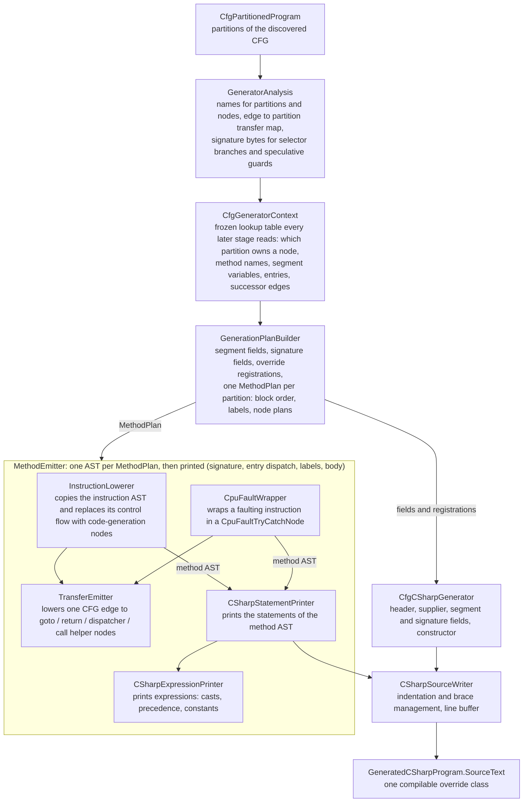

# C# Code Generator

Turns a discovered CFG (control flow graph) into a compilable C# override class that replaces the emulated assembly at runtime.

## What it does

After Spice86 runs a DOS program, it has a complete CFG of every instruction that executed. The generator takes that graph and produces a `.cs` file where each function partition becomes a C# method - gotos instead of jumps, method calls instead of `CALL`, typed register access instead of raw bytes.

## Pipeline overview

`CfgCSharpGenerator.Generate` runs these stages:


```mermaid
flowchart TD
    program["CfgPartitionedProgram<br/>partitions of the discovered CFG"]
    analysis["GeneratorAnalysis<br/>names for partitions and nodes, edge to partition transfer map,<br/>signature bytes for selector branches and speculative guards"]
    context["CfgGeneratorContext<br/>frozen lookup table every later stage reads: which partition owns a node,<br/>method names, segment variables, entries, successor edges"]
    planBuilder["GenerationPlanBuilder<br/>segment fields, signature fields, override registrations,<br/>one MethodPlan per partition: block order, labels, node plans"]
    classParts["CfgCSharpGenerator<br/>header, supplier, segment and signature fields, constructor"]

    subgraph methodEmitter["MethodEmitter: one AST per MethodPlan, then printed (signature, entry dispatch, labels, body)"]
        lowerer["InstructionLowerer<br/>copies the instruction AST and replaces its control flow with code-generation nodes"]
        faultWrapper["CpuFaultWrapper<br/>wraps a faulting instruction in a CpuFaultTryCatchNode"]
        transfer["TransferEmitter<br/>lowers one CFG edge to goto / return / dispatcher / call helper nodes"]
        statementPrinter["CSharpStatementPrinter<br/>prints the statements of the method AST"]
        expressionPrinter["CSharpExpressionPrinter<br/>prints expressions: casts, precedence, constants"]
        lowerer --> transfer
        faultWrapper --> transfer
        lowerer -- "method AST" --> statementPrinter
        faultWrapper -- "method AST" --> statementPrinter
        statementPrinter --> expressionPrinter
    end

    writer["CSharpSourceWriter<br/>indentation and brace management, line buffer"]
    output["GeneratedCSharpProgram.SourceText<br/>one compilable override class"]

    program --> analysis
    analysis --> context
    context --> planBuilder
    planBuilder -- "fields and registrations" --> classParts
    planBuilder -- "MethodPlan" --> methodEmitter
    classParts --> writer
    statementPrinter --> writer
    writer --> output
```

## Key concepts

### Partition = Method

The CFG is split into partitions (groups of blocks that form a logical function). Each partition becomes one C# method. Transfers between partitions become `return OtherMethod(loadOffset);`.

### Plan then write

The generator works in two phases:
1. **Plan** - decide everything up front (method order, labels, entry dispatch, segment fields)
2. **Write** - walk the plan and emit code mechanically, no re-analysis needed

The plan built by `GenerationPlanBuilder.Build` holds, per program: the segment fields, the override registrations and the signature fields (`SignatureFieldPlan`, one `private static readonly byte?[]` per instruction whose bytes are re-read at runtime). Per method (`MethodPlan`): a `PartitionBlockGraph` (`MethodPlan.BlockGraph`), a `DepthFirstOrdering<CfgBlock>` (`MethodPlan.BlockTraversal`), the block order, one `NodeEmissionPlan` per node (carrying `EmitsExternalEventCheck` and `EmitsExternalEventCheckAfter`), the label names and the local variable suffixes.

`MethodEmitter.Emit` then works over that plan like this:
1. build the method AST without writing any text: the entry dispatch (`BuildEntryDispatch`) and one `InstructionBoundaryNode` per node (`BuildBoundary`), whose body is the event check, the speculative guard, the asm comment and the lowered instruction;
2. collect the goto targets with `GotoTargetCollector`: every `GotoNode` target, and whether a `CyclicJumpNode` exists (in which case the `entrydispatcher:` label is written);
3. insert a `LabelNode` only before the nodes that are goto targets;
4. print the method with `CSharpStatementPrinter`.

`MethodEmitter` throws `InvalidOperationException` when the method body can still complete normally (`CompletesNormallyVisitor`), because such a body would fall off its end.

### Block layout

Blocks are emitted in reverse post-order of a depth-first traversal that starts at the primary entry block (`GenerationPlanBuilder.BuildMethodPlan`). Successors are visited non-fallthrough first, in descending address order, and the fallthrough successor last (`GenerationPlanBuilder.LayoutSuccessors`), so the fallthrough block is usually placed right after its predecessor and needs no `goto`. The primary entry is always the first emitted node, so a single-entry method needs no jump at its start.

### Method AST

One method is one AST. Its leaves are the instruction ASTs: the same runtime nodes the interpreter and the JIT use (`BlockNode`, `IfElseNode`, `WhileNode`, registers, memory, ALU calls, ...). Everything that only generated code needs is a code-generation node in `CfgCodeGeneration/Ast/`, visited through `ICodeGenerationAstVisitor<T>`:

| node | what it is |
|---|---|
| `InstructionBoundaryNode` | one CFG node: its event check, speculative guard, asm comment and lowered body; carries the local-variable suffix |
| `GotoNode` / `LabelNode` | a same-method jump to a block entry, and its label; the label text is resolved when printing |
| `EntryDispatcherLabelNode` / `CyclicJumpNode` | the `entrydispatcher:` label, and the cyclic cross-partition re-entry that jumps to it |
| `SwitchNode` / `SwitchSection` / `BreakNode` | entry dispatch and near runtime dispatch; the printer never adds `break;`, `CodeGenerationAst.Section` does |
| `ReturnNode` | `return` of an `Action`: `NearRet()`, `Hlt()`, `OtherMethod(0x0010)`, ... |
| `CpuFaultTryCatchNode` / `CpuFaultHandler` | the `try/catch (CpuException)` of an instruction that faulted during discovery |
| `FailAsUntestedNode` / `UntestedMessagePart` | a `throw FailAsUntested(...)`; the holes of the message are expression nodes |
| `CheckExternalEventsNode`, `SpeculativeGuardNode`, `CommentNode`, `DivisionNode` | the helper calls and the comment of an instruction boundary, and the `Div16` / `IDiv16` tuple call |
| `SegmentVariableNode`, `OffsetLiteralNode`, `InstructionPointerNode`, `LoadOffsetParameterNode`, `MethodGroupNode`, `SignatureFieldNode`, `ExplicitCastNode` | expression leaves: `cs1`, `0x0010`, `IP`, `loadOffset`, a method group or a `_ => M(0x0004)` lambda, a `Signature_...` field, a cast |

Helper calls (`NearCall`, `InterruptCall`, `Callback`, `SelectorSignatureMatches`, ...) reuse the runtime `MethodCallNode` and `MethodCallValueNode`.

Completion rules (`CompletesNormallyVisitor`): a sequence follows its last statement; an `if` completes when one of its arms does; a `while` always completes; a `switch` completes when a section ends with `break` or its default completes; `return`, `goto`, `throw`, `FailAsUntested`, the cyclic jump and `break` never complete.

Rules for code that builds or walks the method AST:

- Lowered code is an `IVisitableAstNode`; "nothing" is an empty `BlockNode`. Build sequences with `CodeGenerationAst.Sequence`, which flattens nested `BlockNode`s, and test emptiness with `CodeGenerationAst.IsEmpty`.
- A lowered tree never contains runtime control-flow nodes (`JumpNearNode`, `CallNearNode`, `MoveIpNextNode`, ...). `CompletesNormallyVisitor` and `GotoTargetCollector` throw `InvalidOperationException` when they meet one.
- Instruction ASTs are shared with the interpreter and the JIT. A rewrite builds new nodes and never changes an existing one; returning an unchanged expression node is allowed because the nodes are immutable.
- A cast the generator adds is an `ExplicitCastNode`, which prints like `CSharpExpressionPrinter.Cast` and never folds constants. `TypeConversionNode` folds constants; it is only for conversions that come from the instruction AST.
- A new code-generation node is added to `ICodeGenerationAstVisitor<T>`, so every visitor (`CSharpExpressionPrinter`, `CompletesNormallyVisitor`, `GotoTargetCollector`) must decide what to do with it. `CSharpStatementPrinter` is a type switch: a new statement node needs its own case there.
- `CSharpStatementPrinter` and `CSharpExpressionPrinter` are the only producers of generated code text. No node holds generated code as a string; identifiers and comment text are not code.

### Edge lowering

Every jump/call/return in the original assembly becomes a "resolved CFG edge" - a source node, a target node, and metadata about what kind of transfer it is. The `TransferEmitter` turns each edge into the appropriate C# construct:

| Edge kind | Generated C# |
|-----------|-------------|
| Same method, next node | *(nothing - fallthrough)* |
| Same method, other node | `goto L_0009;` |
| Cross-partition | `return OtherMethod(0x0000);` |
| Cyclic cross-partition flow | `if (JumpDispatcher.Jump(unknown_F000_0025_F0025, 0x0000)) { loadOffset = JumpDispatcher.NextEntryAddress; goto entrydispatcher; }` then `return JumpDispatcher.RequiredJumpAsmReturn;` |
| Near/far call | `NearCall(cs1, 0x00CC, unknown_F000_0200_F0200);` / `FarCall(cs1, 0x000D, cs2, unknown_F100_0000_F1000);` plus the observed post-call continuation |
| Return | `return NearRet();` when the `ret` has no operand, `return NearRet(0x000A);` when it has one, `return FarRet();` for `retf` |

### External event checks

`CheckExternalEvents(cs, ip)` tells the emulator to deliver pending interrupts and advance emulated time. It is emitted in exactly three places:

1. at the entry of every method entry block; for an entry that sits in the middle of a block, inside its `switch (loadOffset)` case, before the `goto` (`MethodEmitter.BuildEntryDispatch` / `MethodEmitter.EntryEventCheck`);
2. at the entry of every block that is the target of a retreating edge of the layout traversal (loop heads), so every repeating path passes a check;
3. after the body of an instruction that may enable interrupts (`sti`, `popf`, `popfd`), detected on the instruction AST by `InterruptEnableDetectorVisitor` (`sahf` does not count), unless its fallthrough block already checks at its entry.

The two flags that decide this are precomputed per node in `GenerationPlanBuilder.BuildMethodPlan` as `NodeEmissionPlan.EmitsExternalEventCheck` and `NodeEmissionPlan.EmitsExternalEventCheckAfter`. Straight-line code that has none of these three points gets no check, on purpose: emulated time only matters in loops.

### Helpers used by generated code

The generated class derives from `CSharpOverrideHelper`, which provides:

- `DispatchCpuFault(cpuException, cs, ip, [new CpuFaultTarget(...)])` in the `catch` of a faulting instruction;
- `Div8` / `Div16` / `Div32` / `IDiv8` / `IDiv16` / `IDiv32`, each returning `(Quotient, Remainder)`, for example `(AX, DX) = Div16(divisor: CX, dividend: ...);`;
- `In8` / `In16` / `In32` and `Out8` / `Out16` / `Out32` for port I/O;
- `SelectorSignatureMatches` and `VerifySpeculativeEntryOrFail`, which read the `Signature_...` fields;
- `FailAsUntested`, which throws on a path discovery never observed;
- `CheckExternalEvents`, the delivery point described above.

### Naming

Labels are `L_<offset>` (for example `L_0003`), unique per method; the node id is appended only when two nodes of the method share an offset (self-modifying code). Temps use the instruction offset as suffix, per method, with the same collision rule (for example `popDestinationCheck_0073`). Signature fields are `private static readonly byte?[] Signature_<offset>_<mnemonic>` (for example `Signature_0019_jne`), one per instruction, same collision rule. The mnemonic comes from `InstructionMnemonic`, and the collision rule itself is `DisambiguatedNames.Build`, called from `GenerationPlanBuilder` for labels and local suffixes and from `GeneratorAnalysis` for signature fields. Every `FailAsUntestedNode` comes from `UntestedMessages`, one method per kind: `Jump`, `ConditionalFallthrough`, `FallthroughAfter`, `IndirectWithoutTargets`, `NearTarget`, `FarTarget`, `CodeVariant`, `CallbackTarget`, `ReturnFromCall`, `EntryOffset`.

### Untested paths

If an edge was never traversed during discovery, the generated code throws `FailAsUntested(...)` at that point. This makes it safe to run the generated code: it either does exactly what was observed, or fails loudly on an unobserved path.

### CPU fault handling

Instructions that triggered a hardware exception (e.g. divide by zero) during discovery get wrapped in `try/catch(CpuException)`. The `catch` calls `DispatchCpuFault(cpuException, cs, ip, [new CpuFaultTarget(...)])`, which reads the live IVT, matches the handler, performs the fault entry sequence (push flags, push return address, clear interrupts, set CS/IP) and invokes the handler partition.

### Self-modifying code

Instructions at the same address with different bytes (self-modifying code) are handled through selector nodes. The generated code checks which byte signature currently matches memory and branches to the corresponding variant.

## Reusable analyses

Use these before writing a new traversal, graph or naming helper:

| type | location | what it gives |
|---|---|---|
| `PartitionBlockGraph` | `ControlFlowGraph/Analysis/` | blocks, entries, successors, predecessors and fallthrough successor of one partition |
| `DepthFirstOrdering<T>` and `GraphEdge<T>` | `Graph/` | post-order, reverse post-order and retreating edges for any successor function |
| `CodeGenerationAst`, `CompletesNormallyVisitor`, `GotoTargetCollector` | `CfgCodeGeneration/Ast/` | statement sequences and switch sections, completion analysis and goto targets of a lowered tree |
| `InterruptEnableDetectorVisitor` / `StatementPredicateVisitor` | `CPU/CfgCpu/Ast/Visitor/` | boolean predicates over an instruction AST, searching statement containers recursively |
| `DisambiguatedNames` and `InstructionMnemonic` | `CfgCodeGeneration/Naming/` | collision-free names from a base name plus a suffix; an instruction mnemonic as an identifier token |

The dependency rule is `CfgCodeGeneration -> ControlFlowGraph.Analysis -> Graph`, never the other way: nothing under `Graph` or `ControlFlowGraph.Analysis` may reference `MethodPlan`, `NodeEmissionPlan` or anything else under `CfgCodeGeneration`.

## File layout

```
CfgCodeGeneration/
|-- CfgCSharpDumper.cs              writes the generated override file to the recording directory
|-- CfgCSharpGenerator.cs           top-level orchestrator: analyze -> plan -> build method ASTs -> print
|-- CfgGeneratorContext.cs          frozen lookup table shared by every stage
|-- CpuFaultWrapper.cs              wraps a faulting instruction in a CpuFaultTryCatchNode
|-- CSharpExpressionPrinter.cs      prints expression nodes as C# fragments: casts, precedence, constants
|-- CSharpSourceWriter.cs           indentation, braces and line buffer
|-- CSharpStatementPrinter.cs       prints a method AST as C# statements
|-- DivisionPattern.cs              recognizes the DIV/IDIV statement pattern and carries its operands
|-- GeneratedProjectScaffolder.cs   csproj + Program.cs scaffold for a runnable project
|-- GenerationPlanBuilder.cs        builds the plan (fields, registrations, per-method plans)
|-- GeneratorAnalysis.cs            first pass: names, transfers, signature bytes
|-- InstructionLowerer.cs           lowers an instruction AST; control flow becomes code-generation nodes
|-- MethodEmitter.cs                builds one AST per method, then prints it
|-- TransferEmitter.cs              lowers one CFG edge to goto / return / dispatcher / call nodes
|-- UntestedMessages.cs             the FailAsUntested nodes, one per untested situation
|-- Ast/
|   |-- ICodeGenerationAstVisitor.cs    visitor over runtime and code-generation nodes
|   |-- CodeGenerationNode.cs           the Accept rule shared by the code-generation nodes
|   |-- CodeGenerationAst.cs            Sequence / Empty / IsEmpty / Section helpers
|   |-- CompletesNormallyVisitor.cs     completion analysis of a lowered tree
|   |-- GotoTargetCollector.cs          goto targets of a lowered tree
|   |-- GotoTargets.cs                  target labels + entry dispatcher flag
|   `-- *Node.cs, SwitchSection.cs, CpuFaultHandler.cs, UntestedMessagePart.cs
|                                       the code-generation nodes (see "Method AST")
|-- Model/
|   |-- CallContinuation.cs         expected return address + observed post-call edge
|   |-- CSharpFragment.cs           a printed expression with its type and precedence
|   |-- GeneratedCSharpProgram.cs   the produced source text
|   |-- GeneratedOverrideNames.cs   namespace, class and file names baked into the output
|   |-- ResolvedCfgEdge.cs          a source/target edge with its successor kind
|   `-- Plan/
|       |-- GenerationPlan.cs       segment fields, signature fields, registrations, methods
|       |-- MethodPlan.cs           one method: blocks, nodes, labels, traversal, entry dispatch
|       |-- NodeEmissionPlan.cs     per-node emission decisions
|       |-- OverrideRegistration.cs one DefineFunctionWithoutInterpreterFallback registration
|       |-- SegmentFieldPlan.cs     one segment field declaration
|       `-- SignatureFieldPlan.cs   one byte?[] signature field
`-- Naming/
    |-- DisambiguatedNames.cs       base name + suffix disambiguation
    `-- InstructionMnemonic.cs      instruction mnemonic as an identifier token
```
