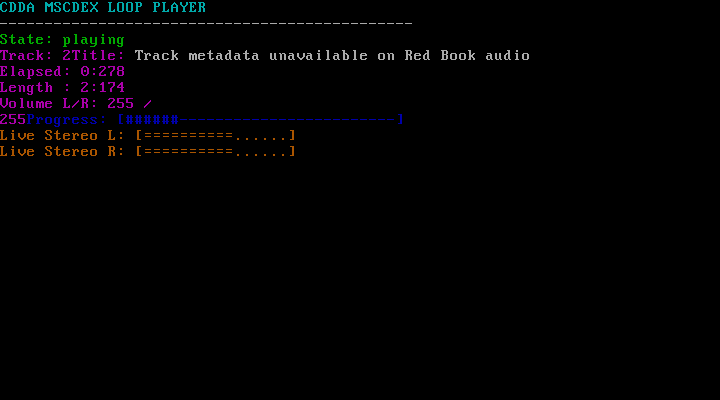

# CDDA DOS Assembly Example

This folder contains a standalone DOS CDDA playback example using MSCDEX.

Files:

- `cdda_mscdex_loop.asm`: NASM source for a 16-bit `.COM` player.
- `CDDA.COM`: prebuilt example binary.
- `launch_mw2_cdda.bat`: batch launcher for Spice86 / DOS shell startup.

Behavior:

- Uses `IMGMOUNT D "C:\jeux\isos\MechW2.cue" -t cdrom`.
- Mounts this folder as DOS `C:`.
- Launches `CDDA.COM`.
- `CDDA.COM` loops through detected audio tracks indefinitely.

Build in WSL:

```bash
nasm -f bin cdda_mscdex_loop.asm -o CDDA.COM
```

Run example:

```powershell
dotnet run --project src/Spice86 -- --Executable src\Spice86.Storage.Cd\examples\cdda-assembly\launch_mw2_cdda.bat --Debug
```

Screenshot:


